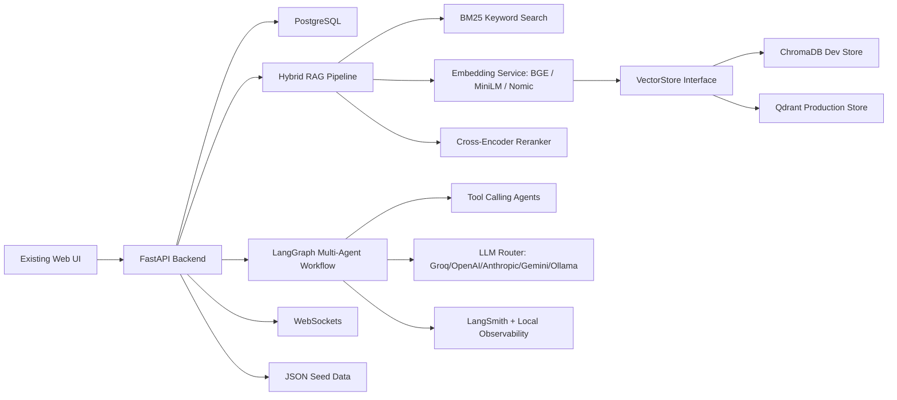
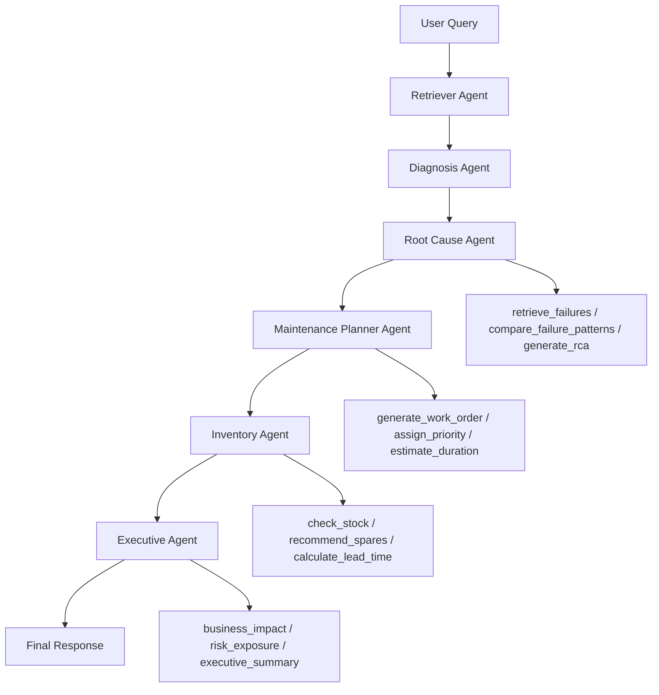
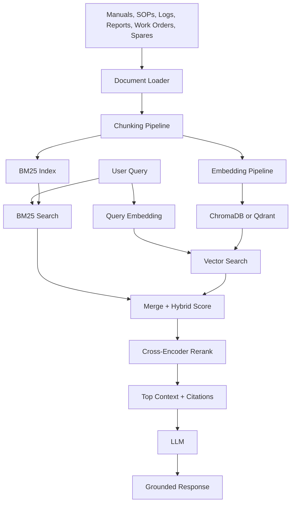

# Maintenance Wizard - AI Engineer Stack Modernization

## Architecture Diagram



## Updated Folder Structure

```text
backend/
  api/
  agents/
    tool_agents.py
  rag/
    hybrid_retriever.py
  vectorstores/
  services/
  models/
  db/
  embeddings/
  memory/
  reports/
  telemetry/
  tests/
frontend/
  components/
  pages/
  hooks/
  services/
data/
  manuals/
  sops/
  failures/
  maintenance/
```

## Database Schema

```sql
assets(id, payload)
sensor_data(id, equipment_id, payload)
sensor_history(id, equipment_id, payload)
failure_modes(id, equipment_id, payload)
failure_reports(record_id, equipment_id, payload)
maintenance_logs(log_id, equipment_id, payload)
spare_parts(part_id, equipment_id, payload)
work_orders(work_order_id, equipment_id, payload)
copilot_conversations(id, equipment_id, payload, created_at)
sector_health(sector, payload)
asset_relationships(id, source_asset, target_asset, payload)
```

## LangGraph Workflow Diagram



## RAG Pipeline Diagram



## Migration Summary

- Added FastAPI backend with REST, Swagger/OpenAPI, static frontend serving, and WebSocket endpoints.
- Added Pydantic request models.
- Added PostgreSQL schema and JSON seed loader.
- Added Hybrid RAG document loader, chunker, BM25 keyword search, embedding service, vector retrieval, merge scoring, reranking, and context assembly.
- Added VectorStore abstraction with ChromaDB and Qdrant adapters plus in-memory fallback.
- Added LangGraph-compatible multi-agent workflow with tool calling agents for work orders, inventory, root cause analysis, and executive decision support.
- Added LLM router preserving Llama/Groq fallback and deployment-ready provider expansion.
- Added conversation memory, streaming LLM facade, source citations, confidence engine, LangSmith-ready observability, Dockerfile, Docker Compose, and pytest coverage.

## Validation Report

Run:

```powershell
python -m py_compile backend/main.py backend/agents/langgraph_workflow.py backend/rag/pipeline.py
pytest backend/tests
uvicorn backend.main:app --port 8012
```

Expected:

- Existing UI still loads at `/`.
- Swagger available at `/docs`.
- Current frontend API behavior preserved.
- New routes available: `/api/assets`, `/api/sensors`, `/api/failures`, `/api/workorders`, `/api/copilot`, `/api/reports`, `/api/rul`, `/api/business-impact`, `/api/digital-twin`, `/api/search`.
